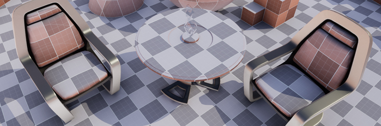

# ue4-grid-material
A procedural, world-space grid material for level blockouts. Created by Nick Mower in Unreal Engine 4.

Full tutorial can be found here: https://www.techarthub.com/making-a-procedural-grid-material-in-unreal-engine-4/

This project is licensed under the Unreal Engine 4 EULA.
